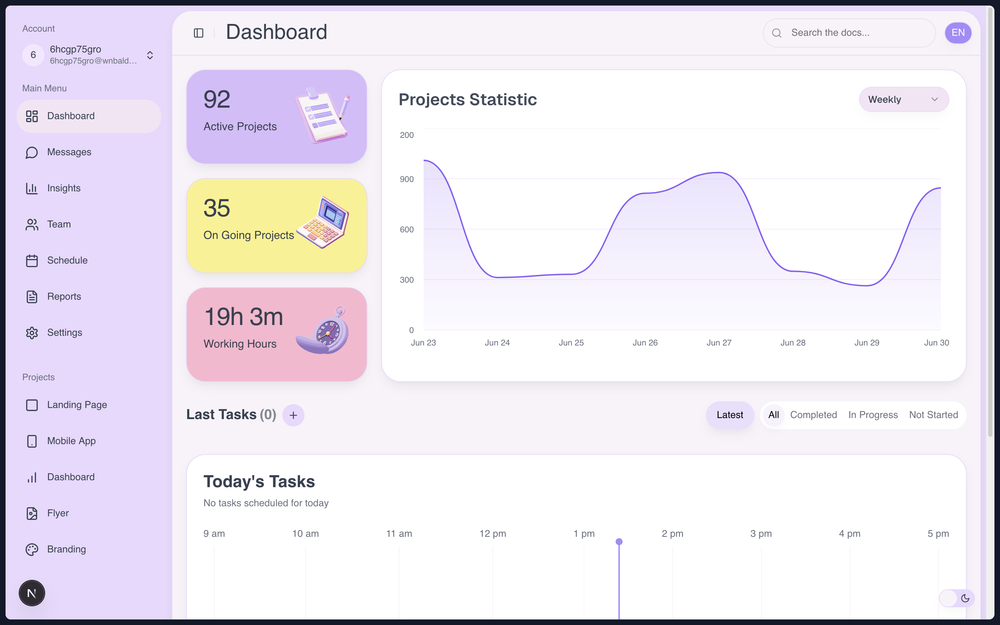
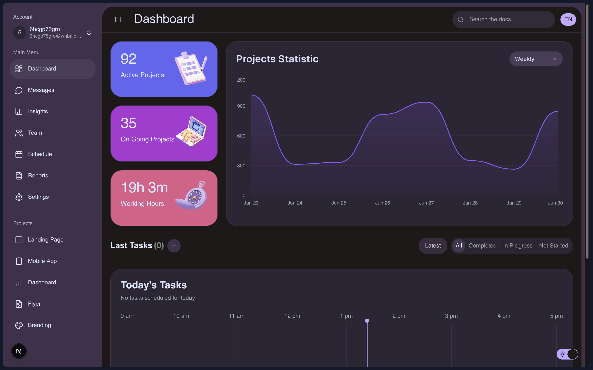
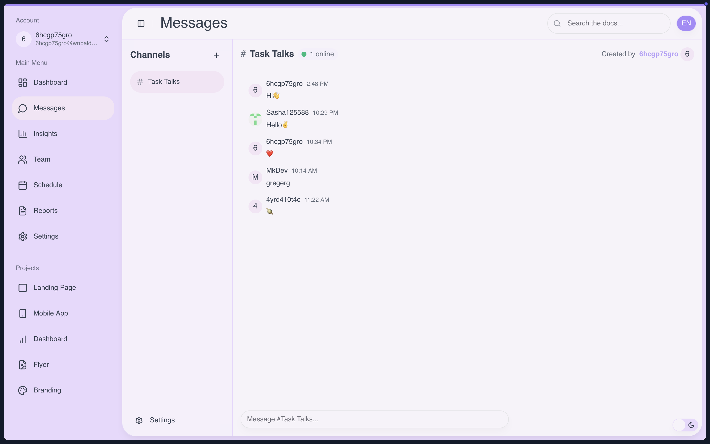
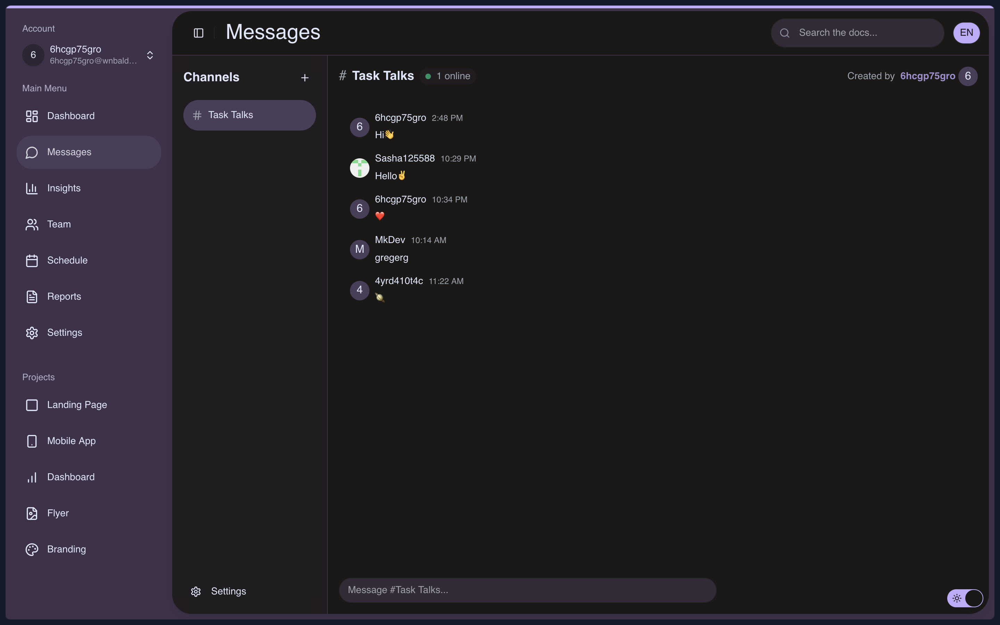

# 🚀 Task Hub

Современный таск-менеджер с красивым интерфейсом и мощным функционалом для управления задачами и проектами.



## ✨ Особенности

- 📋 **Управление задачами** - создание, редактирование и отслеживание задач
- 📊 **Статистика и аналитика** - визуализация прогресса и производительности
- 💬 **Встроенный чат** - общение с командой прямо в приложении
- 🎨 **Современный UI** - красивый и интуитивный интерфейс
- 🌙 **Темная/светлая тема** - поддержка обеих тем оформления
- 🌍 **Мультиязычность** - поддержка русского, украинского и английского языков
- 📱 **Адаптивный дизайн** - отлично работает на всех устройствах
- ⚡ **Быстрая работа** - оптимизированная производительность

## 🛠 Технологии

- **Frontend**: Next.js 15, React 19, TypeScript
- **Стилизация**: Tailwind, Shadcn UI
- **Анимации**: Motion (Framer Motion)
- **Состояние**: Effector, React Query
- **База данных**: Supabase
- **Аутентификация**: Better Auth
- **Формы**: React Hook Form, Zod
- **Иконки**: Lucide React
- **Уведомления**: Sonner
- **Email**: React Email, Resend

## 🚀 Быстрый старт

### Предварительные требования

- Node.js 18+ или Bun
- Supabase аккаунт
- Better Auth аккаунт

### Установка

1. Клонируйте репозиторий:

```bash
git clone https://github.com/Sasha125588/task-hub.git
```

2. Установите зависимости:

```bash
npm install
# или
bun install
```

3. Настройте переменные окружения:

```bash
cp .env.example
```

4. Заполните необходимые переменные в `.env`:

```env
BETTER_AUTH_SECRET=secret
NEXT_PUBLIC_BETTER_AUTH_URL=url

NEXT_PUBLIC_GITHUB_CLIENT_ID=id 
NEXT_PUBLIC_GITHUB_CLIENT_SECRET=secret

NEXT_PUBLIC_GOOGLE_CLIENT_ID=id
NEXT_PUBLIC_GOOGLE_CLIENT_SECRET=secret

NEXT_PUBLIC_RESEND_API_KEY=key
NEXT_PUBLIC_MY_EMAIL=email

NEXT_PUBLIC_DATABASE_URL=url
NEXT_PUBLIC_SUPABASE_CHAT_ANON_KEY=key
NEXT_PUBLIC_SUPABASE_CHAT_URL=url

NEXT_PUBLIC_VERCEL_URL=url

NEXT_PUBLIC_API_URL=url

```

5. Запустите проект:

```bash
npm run dev
# или
bun dev
```

Откройте [http://localhost:3000](http://localhost:3000) в браузере.

## 📱 Скриншоты

### Dashboard



### Chat Interface





## 🏗 Структура проекта

```
src/
├── app/                   # Next.js App Router
│   ├── (auth)/            # Страницы аутентификации
│   └── (private)/         # Защищенные страницы
├── components/            # React компоненты
│   ├── ui/                # Базовые UI компоненты
│   ├── layout/            # Компоненты макета
│   └── animate-ui/        # Анимированные компоненты
├── lib/                   # Утилиты и конфигурации
├── stores/                # Effector stores
├── types/                 # TypeScript типы
└── utils/                 # Вспомогательные функции, константы, запросы
```

## 🎯 Основной функционал

### Управление задачами

- Создание и редактирование задач
- Подзадачи и вложенные элементы
- Приоритеты и статусы
- Дедлайны и напоминания
- Drag & Drop сортировка

### Аналитика

- Статистика по задачам
- Графики производительности
- Отчеты по времени
- Прогресс проектов

### Коммуникация

- Встроенный чат
- Каналы общения
- Отправка сообщений
- Уведомления

## 🌟 Особенности разработки

- **TypeScript** - полная типизация
- **ESLint + Prettier** - качество кода
- **Husky** - Git hooks
- **OpenAPI** - автоматическая генерация типов
- **i18n** - интернационализация
- **Responsive Design** - адаптивность

## 📝 Скрипты

```bash
npm run dev          # Запуск в режиме разработки
npm run build        # Сборка для продакшена
npm run start        # Запуск продакшен сервера
npm run lint         # Проверка кода
npm run generate-types # Генерация типов из OpenAPI
```

## 🤝 Вклад в проект

1. Форкните репозиторий
2. Создайте ветку для новой функции (`git checkout -b feature/amazing-feature`)
3. Зафиксируйте изменения (`git commit -m 'Add amazing feature'`)
4. Отправьте в ветку (`git push origin feature/amazing-feature`)
5. Откройте Pull Request

## 📄 Лицензия

Этот проект лицензирован под MIT License - см. файл [LICENSE](LICENSE) для деталей.

## 📞 Контакты

- **Автор**: Sasha125588
- **GitHub**: [https://github.com/Sasha125588]

---

⭐ Если проект вам понравился, поставьте звездочку!
